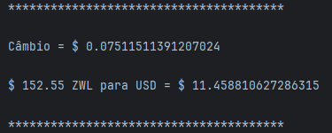

## Conversor de moedas para o Challenge da Alura referente ao programa ONE - Oracle Next Education.  

O projeto Conversor de Moedas foi desenvolvido em Java usando IntelliJ IDEA Community Edition. 

Possui dependência da biblioteca gson-2.10.1.jar. 

Ele utiliza os dados da API de https://www.exchangerate-api.com/ e realiza conversões de acordo com as escolhas do usuário.   

Ao inciar o programa primeiramente uma lista das moedas mais utilizadas é exibida: 

É possível também listar todas as moedas disponíveis e escolher pelo código. 

Ao escolher a primeira moeda será perguntado novamente para qual moeda você deseja converter o valor. 

Ao escolher a segunda moeda, deve ser digitado o valor a ser convertido. 

Após isso, o programa irá calcular a taxa de câmbio e converter de acordo. 

Após fazer a conversão das moedas, o programa irá perguntar ao usuário o que ele deseja fazer. 

É possível mostrar a lista das conversões feitas durante o uso do programa conforme a opção escolhida. 

Caso ocorra algum erro durante a execução, o mais provável é que a chave da API não é mais válida. 
Existe um JSON de testes na classe ExchangeRateAPI.java que pode ser utilizado nessa situação, ou então a chave da API deve ser atualizada.  

 
 

### Autores:
<a href="https://github.com/jhonathan-p" target="_blank">Jhonathan Pfeiffer Urbainski</a>